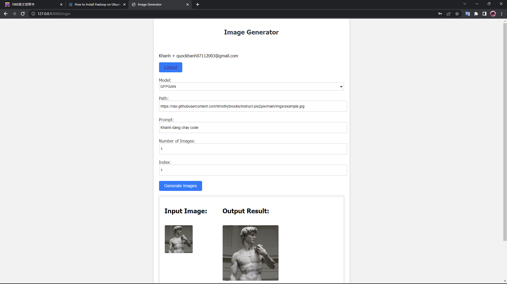

# Sofware-Engineering-Final_Project

Source Code Bài tâp lớn Kỹ thuật phần mềm về quản lí trang web ứng dụng các mô hình sinh để sinh ảnh và câu văn

## Sử dụng: 

         - python, html, js, css
         - Framework: Pytorch --> Xây dựng mo hình, huấn luyện lưu kết quả.

## Nhóm 8: 

                             | Nguyễn Quốc Khánh|  Lê Vĩnh Hưng | Đào Đức Minh |
                             |     21011495     |   21010988    |   21010586   |  
                             |     K15-KHMT     |  K15-CNTT-VJ1 |   K15-CNTT1  |

## Hướng dẫn chạy code:

Clone code từ git

         git clone https://github.com/qkhanh711/Sofware-Engineering-Final-Project.git

sau khi clone có folder:

        Software-Engineering-Final-Project/
            app/
                Images/
                model/
                modules/
                static/
                style/
                tmplates/
                gan_app.db
                Generate.py
                main.py
                utils.py
            README.md
            requirement.txt

## How to Run

**Bước 1:** Cài đặt anaconda

        https://repo.anaconda.com/archive/Anaconda3-2023.07-1-Windows-x86_64.exe

**Bước 2:** Mở anaconda powershell prompt, tạo environment, kích hoạt environment
    
        conda create --name SE python=3.10
        conda activate SE

**Bước 3:** Di chuyển tới thư mục Software-Engineering-Final-Project, tải các package cần có để chạy code ở file requirement.txt bằng lệnh sau:
        
        pip install -r requirement.txt

**Bước 4:** Sau khi xong bước 3, di chuyển tới thư mục app nhập sau để chạy server địa chỉ mặc định là localhost:8000

        uvicorn main:app --reload

**Bước 5:** Ctrl+Click vào localhost mở trên web hiện giao diện đăng nhập:

--> Thực hiện đăng ký tài khoản (Click vào Register). Sau khi đăng nhập thành côgn sẽ về lại Login

**Bước 6:** Sau khi đăng nhập sẽ hiện giao diện sản phẩm, Nhập các Input và trải nghiệm

